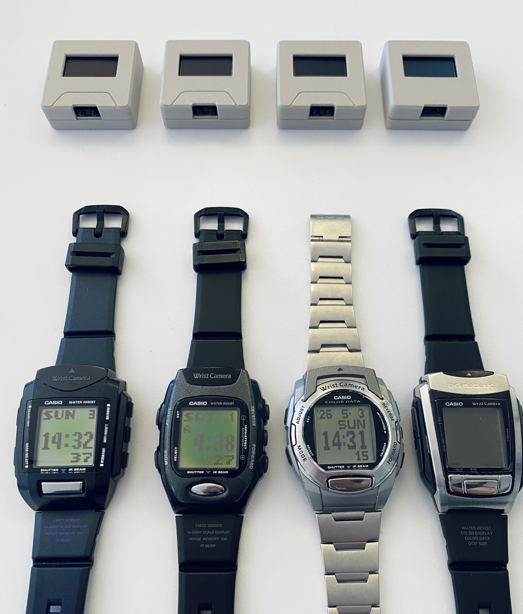

# WQV Blink
#### A Casio WQV Series USB Sync Dongle

This is an easy-to-use, self-contained device that retrieves photos from the series of extremely cool 2000-era [Casio WQV camera watches](https://www.casio.com/us/watches/50th/Heritage/2000s/) and stores them as a USB drive.

## Manual

See the [wiki](https://github.com/partlyhuman/wqv-blink/wiki) for all instructions!

## Purchase

Pre-assembled devices ars available in limited quantities on my [Ko-Fi shop](https://ko-fi.com/s/76fb4d3271)!

## Compatibility

Firmware [wqv12](firmware/wqv12):
* WQV-1 ✅
* WQV-2 ✅

Firmware [wqv310](firmware/wqv310):
* WQV-3 ✅
* WQV-10 ✅

## Building

The PCB, case, and firmware in this repository go together as pictured here. 

Gerbers are [included](pcb/WQV1-S3-SuperMini/production/). Fabricate with basic options, nothing fancy. 1.6mm thickness, HASL is just fine.

| Reference | Value | Details |
|----|----|----|
| R1 | 0-20R | 0805 Resistor |
| C1 | 1uF | 0805 Capacitor |
| C2 | 1uF | 0805 Capacitor |
| C3 | 0.1uF | 0805 Capacitor |
| U1 | ESP32-S3 Super Micro | https://www.aliexpress.com/item/1005007523988592.html |
| U2 | SSD1306_OLED_128x64 | https://www.aliexpress.com/item/1005006141235306.html (Yellow Blue) |
| U3 | TFDU4101-TR3 | https://www.digikey.com/short/nrdh27mb |

R1 is used to save power to the IR LED. The TFDU4101 has built-in LED resistors so this can be 0R for maximum TX power. There is a lot of good info on sample circuits and component values in the [TFDU4101 datasheet (PDF)](https://www.vishay.com/docs/81288/tfdu4101.pdf)

The [case](case/) is split into a top and bottom print. It can be printed with very basic settings. With the correct orientation, no supports are needed.

Builds are made with PlatformIO. In the firmware's directory, run `pio run -e esp32_s3_supermini` or use the PlatformIO VSCode extension. Note that this will not give you the dual-boot/dual-firmware option; for this, extra scripts are included. Alternatively, if you do not need to change anything, you can use the [web updater](https://wqv.partlyhuman.com/) to program the ESP32.

## DIY Build options

Breakouts are included to make a hand-wired device possible using breadboards, perfboards, jumpers, etc.

Currently this builds on ESP32-S2 and -S3 based boards. You can choose to include a common 0.96" monochrome SSD1306 screen or not based on the Platform.io environment.

Other ESP32 SoCs like the C3 lack the hardware to support USB Device mode, which we use to mount as a USB drive. See the [Espressif USB peripheral FAQ](https://docs.espressif.com/projects/esp-faq/en/latest/software-framework/peripherals/usb.html).

PSRAM is used if found on your board, but is not required. Flash space large enough to store 99 images (<1MB) as well as the program is required, should not be an issue.

A [Vishay TFDU4101](https://www.vishay.com/en/product/81288/) is the only required external component, used for bidirectional IRDA communication with the watch. It is still in production and widely available for cheap! In this repository you will find breakout PCBs that will give it 2.54mm standard header pins, [one barebones](pcb/TFDU4101-breakout/), and a more [user-friendly one](pcb/TFDU4101-breakout-simplified/) which includes the passive components, and a solder bridge to optionally power the IR LED & logic from a single supply (recommended, up to +6V is acceptable according to the datasheet). The silkscreen gives two possible orientations of the TFDU4101 so you can choose to aim it upwards or outwards. Double-check pin 1 to make sure your orientation is correct.
